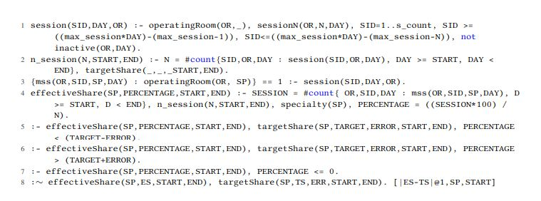
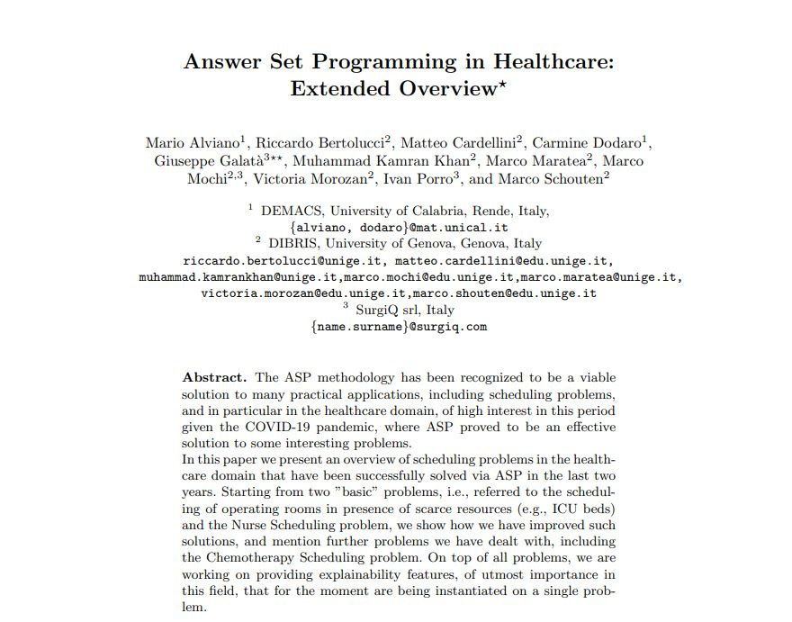

<h2 id="publications" style="margin: 2px 0px -15px;">Publications <temp style="font-size:15px;">[</temp><a href="https://scholar.google.com/citations?user=SdQ_lIIAAAAJ" target="_blank" style="font-size:15px;">Google Scholar</a><temp style="font-size:15px;">]</temp>
</h2>

<ol class="bibliography">
  

<li>

  

    
            <abbr class="badge">CILC</abbr>
  

  

      
<a href="https://ceur-ws.org/Vol-3204/paper_33.pdf">An ASP-based Approach to Master Surgical Scheduling</a>

      
 Cademartori, L., Galatà, G., Monaco, C. L., Maratea, M., Mochi, M., & <strong>Schouten, M.</strong>

      
<em>37th Italian Conference on Computational Logic, CILC, 2022.</em>
      

    

      <a href="https://ceur-ws.org/Vol-3204/paper_33.pdf" class="btn btn-sm z-depth-0" role="button" target="_blank" style="font-size:12px;">PDF</a>
      <!-- <a href="https://github.com/yaoyao-liu/CL-DETR" class="btn btn-sm z-depth-0" role="button" target="_blank" style="font-size:12px;">Code</a>
      <a href="https://lyy.mpi-inf.mpg.de/CL-DETR/" class="btn btn-sm z-depth-0" role="button" target="_blank" style="font-size:12px;">Project Page</a>
      <a href="https://bib.yliu.me/CVPR23a.txt" class="btn btn-sm z-depth-0" role="button" target="_blank" style="font-size:12px;">BibTex</a>  -->
    

  

</li>

 

<li>

  

    
            <abbr class="badge">AI*IA</abbr>
  

  

      
<a href="https://ceur-ws.org/Vol-2745/paper7.pdf">Answer Set Programming in Healthcare: Extended Overview</a>

      
Alviano, M., Bertolucci, R., Cardellini, M., Dodaro, C., Galatà, G., Khan, M.K., Maratea, M., Mochi, M., Morozan, V., Porro, I. and <strong>Schouten, M.</strong>

      
<em> IPS-RCRA@ AI* IA, 2020.</em>
      

    

      <a href="https://ceur-ws.org/Vol-2745/paper7.pdf" class="btn btn-sm z-depth-0" role="button" target="_blank" style="font-size:12px;">PDF</a>
      <!-- <a href="https://github.com/MrGiovanni/ContinualLearning" class="btn btn-sm z-depth-0" role="button" target="_blank" style="font-size:12px;">Code</a> -->
      <!-- <a href="https://bib.yliu.me/MICCAI23.txt" class="btn btn-sm z-depth-0" role="button" target="_blank" style="font-size:12px;">BibTex</a>  -->
      <!-- <strong> <i style="color:#e74d3c">Early Accept</i></strong> -->
    

  

</li>

 

</ol>

